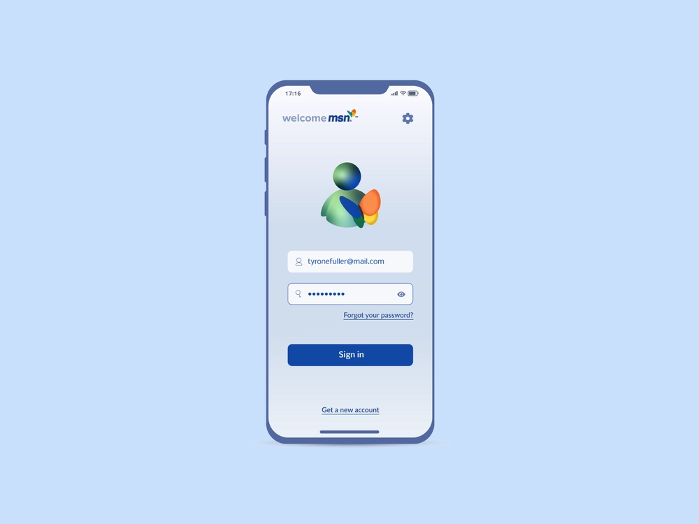
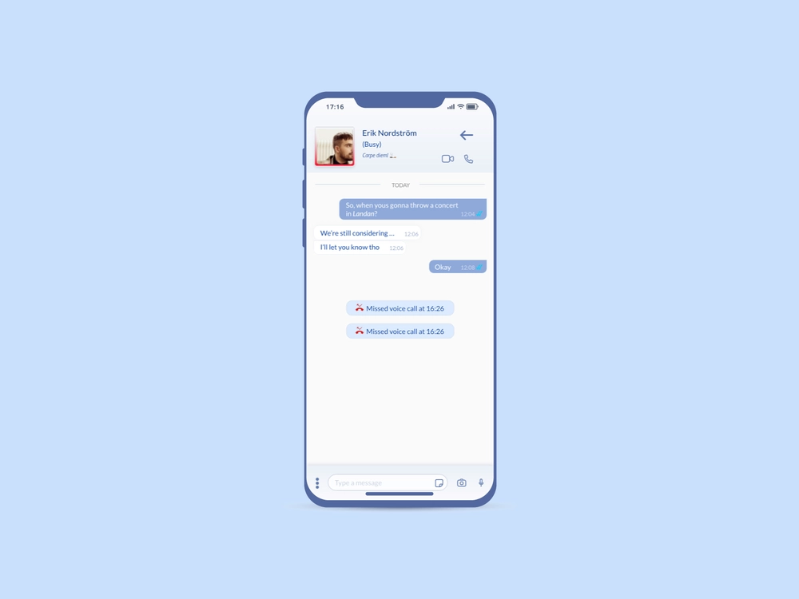
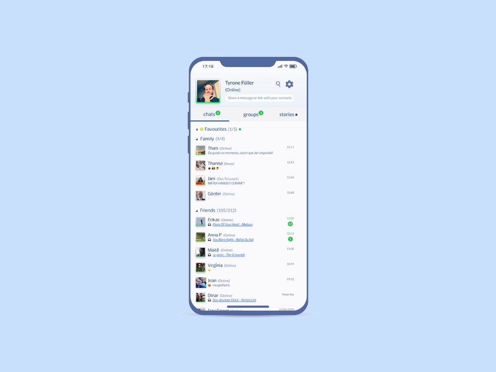
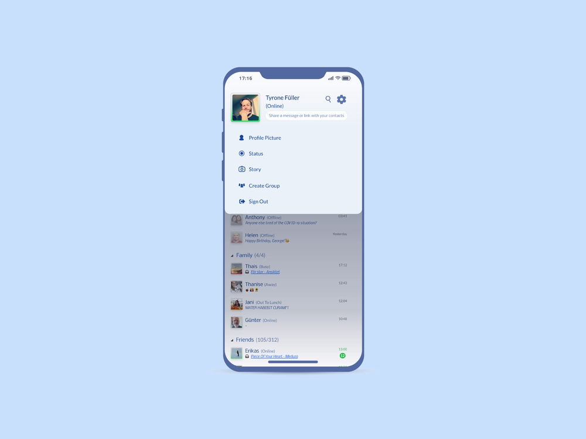
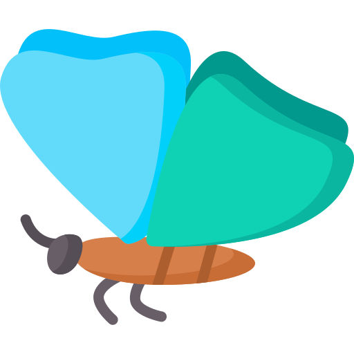

# The Butterfly project

Butterfly is a full stack chat application built with Flutter and Dart Frog.

## Front end Inspiration

### Design mockups

The front part is inspired by a Dribbble shot by [Tyrone Füller](https://dribbble.com/shots/13497348-Reimagining-Classics-MSN-Messenger-App)

</img>
</img>

</img>
</img>

### Logo

</img>

The logo was downloaded from flaticon website.

Thanks to [Freepik](https://www.flaticon.com/authors/freepik) for the logo.

<a href="https://www.flaticon.com/fr/icones-gratuites/papillon" title="papillon icônes">Papillon icônes créées par Freepik - Flaticon</a>

## Back end Inspiration

The back part is inspired from a Tweet by [Very Good Ventures](https://twitter.com/VGVentures/status/1611480098393161728) using websockets.

## Colors

Swatch 1: `#94B8FB`

Swatch 2: `#D8DEEF`

Swatch 3: `#929BB3`

Swatch 4: `#192758`

Swatch 5: `#4E609B`

Swatch 6: `#978A40`

## Flutter

Front end is built with Flutter.

More information about Flutter can be found on the [Flutter website](https://flutter.dev/).

See `butterfly_front` for front end code.

## Dart Frog

Back end is built with Dart Frog.

More information about Dart Frog can be found on the [Dart Frog website](https://dartfrog.vgv.dev/)

See `butterfly_back` for back end code.

# Used packages

| Package | Description | Link |
| ------- | ----------- | ---- |
| melos | Monorepo management | [melos](https://pub.dev/packages/melos) |
| freezed | Code generation | [freezed](https://pub.dev/packages/freezed) |
| freezed annotation | Code generation | [freezed_annotation](https://pub.dev/packages/freezed_annotation) |
| json annotation | Code generation | [json_annotation](https://pub.dev/packages/json_annotation) |
| json_serializable | Code generation | [json_serializable](https://pub.dev/packages/json_serializable) |
| collection | Collections | [collection](https://pub.dev/packages/collection) |
| easy_localization | Localization | [easy_localization](https://pub.dev/packages/easy_localization) |
| flutter_riverpod | State management | [flutter_riverpod](https://pub.dev/packages/flutter_riverpod) |
| go_router | Routing | [go_router](https://pub.dev/packages/go_router) |
| look | UI/Widget Testing | [look](https://pub.dev/packages/look) |
| flutter_launcher_icons | Icons generation | [flutter_launcher_icons](https://pub.dev/packages/flutter_launcher_icons) |
| flutter_lints | Linting | [flutter_lints](https://pub.dev/packages/flutter_lints) |
| golden_toolkit | Golden testing | [golden_toolkit](https://pub.dev/packages/golden_toolkit) |
| look_generator | Code generation | [look_generator](https://pub.dev/packages/look_generator) |
| build_runner | Code generation | [build_runner](https://pub.dev/packages/build_runner) |
| dart_frog | Dart backend | [dart_frog](https://pub.dev/packages/dart_frog) |
| mocktail | Mocking | [mocktail](https://pub.dev/packages/mocktail) |
| test | Testing | [test](https://pub.dev/packages/test) |
| very_good_analysis | Linting | [very_good_analysis](https://pub.dev/packages/very_good_analysis) |